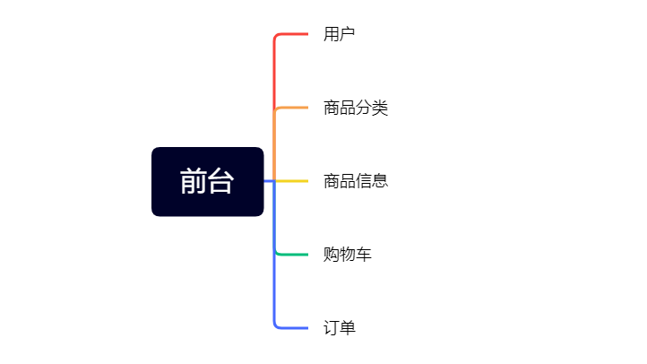
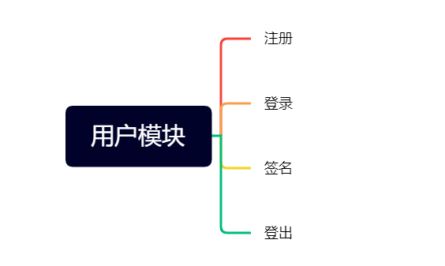
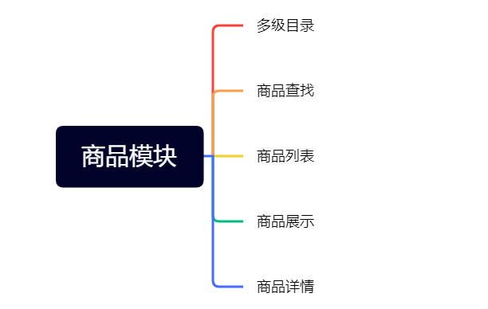
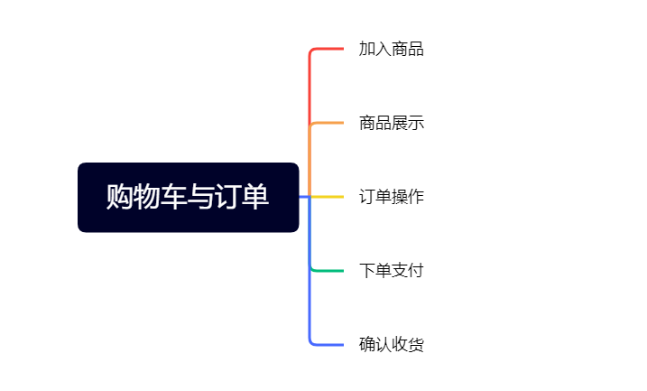
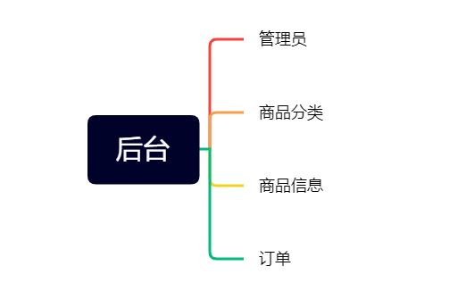
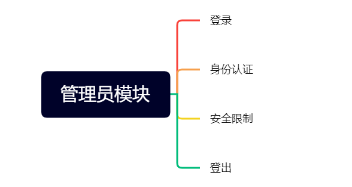
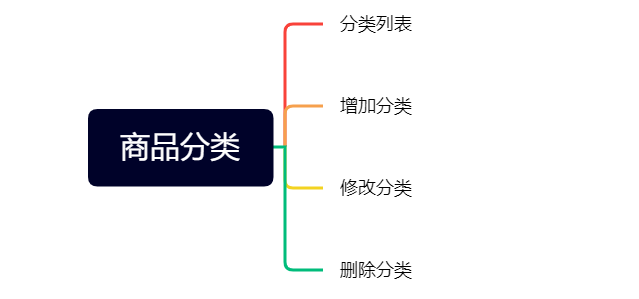
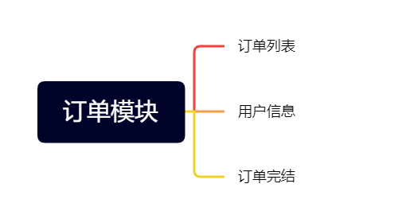

#西游超市
这是一个未上线的西游线上超市,包括 xiyou-mall 商城系统及 xiyou-mall-admin 商城后台管理系统，
基于前后端分离技术，后端基于 Spring Boot 及相关技术栈开发。 前台商城系统包含商品分类、商品信息
、商品搜索、购物车、订单、个人订单管理等模块。 后台管理系统包含用户数据面板、 商品管理、订单管理
、会员管理、分类管理、设置等模块。
***
#功能介绍
>##前台
>
>>####用户模块
>>
>>####商品模块
>>
>>####购物车与订单
>>
>***
>##后台
>
>>###管理员模块
>>
>>###商品分类
>>
>>###商品模块
>>
>>###订单模块
>>
> ***
##总结
熟悉了spring boot框架，掌握了前后端交互方式，熟悉了git使用，提高了合作能力
